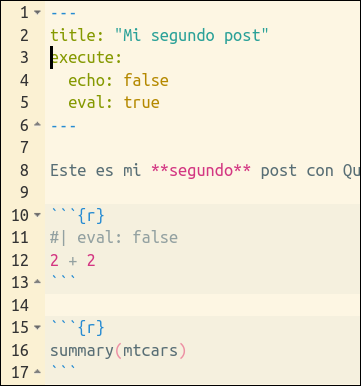

# Lo que ya sabemos {background-color="#b8c2aa"}





<br>

. . .

-   Trabajamos con Qprojects

-   Documento fuente escrito en **Qmd** genera diferentes outputs

# ¿Qué es Quarto? {.unnumbered background-color="#ebf5fb"}





> Quarto is a multi-language, next generation version of R Markdown, with many new features and capabilities.

. . .

<br>

Puedes ver [este video](https://www.youtube.com/watch?v=_20US068pzk) de 100 segundos

## ¿Qué es Quarto?

. . .

-   Un **nuevo sistema de publicación científica y técnica** de código abierto basado en Pandoc


. . .

-   Quarto no es un paquete, **es un programa independiente**, un CLI


. . .

-   Permite incorporar **texto y código** para producir documentos (reproducibles) en múltiples formatos

. . .

-   Es ... la "**segunda generación de Rmarkdown**"

. . .

-   Muy **parecido a Rmarkdown**, pero ... **no requiere R**. Soporta lenguajes como Phyton, Julia y Observable.

-   Quarto utiliza Knitr para ejecutar el código R; así que es **capaz de procesar también los ficheros .Rmd** sin modificarlos


<br>

------

## {background-color="#DCDCDC"}


::: {.callout-warning collapse="true" appearance="default" icon="false"}
#### Extensión:  Ventajas de Quarto sobre RMD

-   Proyecto en [desarrollo activo](https://quarto.org/docs/download/) ... mientras que Rmarkdown [it's not going away](https://yihui.org/en/2022/04/quarto-r-markdown/) pero ...

-   Quarto **unifica funcionalidades** de varios paquetes del entorno Rmd como xaringan, bookdown, blogdown , ...

-   **Por ejemplo**: Cross references, Call-outs, Advanced Layout (tb para imágenes), Extensiones, Interactividad, YAML inteligence, Quarto Pub, Divs, Spans

-   Para ver si estas ventajas merecen la pena para ti puedes leer a [Occasional Divergences](https://occasionaldivergences.com/posts/quarto-questions/#what-are-the-benefits-of-using-quarto-for-_____), [Nick Tierney](https://www.njtierney.com/post/2022/04/11/rmd-to-qmd/), [Alison Hill](https://www.apreshill.com/blog/2022-04-we-dont-talk-about-quarto/), [Danielle Navarro](https://blog.djnavarro.net/posts/2022-04-20_porting-to-quarto/), [Jumping Rivers](https://www.jumpingrivers.com/blog/quarto-rmarkdown-comparison/) o [esta pregunta](https://stackoverflow.com/questions/72089640/what-are-the-benefits-of-using-quarto-over-rmarkdown) de Stack Overflow.


:::

<br>

------ 

## {background-color="#DCDCDC"}


::: {.callout-warning collapse="true" appearance="default" icon="false"}
#### Extensión: ¿Qué es Rmarkdown? ¿Para qué sirve?

-   El predecesor de Quarto

-   Un ["entorno"](https://vimeo.com/178485416) para hacer informes/publicaciones/transparencias **REPRODUCIBLES** con R.

> Is an authoring framework for data science, combining your code, its results, and your prose. R Markdown documents are fully reproducible and support dozens of output formats, like PDFs, Word files, slideshows, and more.

-   Con Rmd se pueden generar **multitud de outputs**. Por ejemplo, visita [está galería](https://rmarkdown.rstudio.com/gallery.html) o [este listado](https://rmarkdown.rstudio.com/formats.html)

<br>

#### Una oda a Rmarkdown

-   [How Rmarkdown changed my life](https://www.youtube.com/watch?v=_D-ux3MqGug&list=PLXKlQEvIRus-qu1hjc8SyElSamAcT-KaE&index=6): charla de Rob Hyndman sobre su proceso hasta llegar a usar Rmarkdown para hacer sus documentos científicos y webs.
:::

------------------------------------------------------------------------

## Para poder practicar lo que vayamos aprendiendo ... 

<br><br>

::: {.callout-important icon="false"}
#### Tarea 3.0: Vamos a crear un nuevo Qproject

- Cierra RStudio 

- Crea un nuevo Qproject llamado "my_qproject"

- Inspecciona los documentos que hay dentro de "my_qproject"

- Borra el archivo `my_qproject.qmd`

- Crea un archivo `.qmd`

- Procésalo y llámalo `prueba_01.qmd`

<br>

:::


# Qmarkdown: guía rápida (`.qmd`) {background-color="#b8c2aa"}


## Los documentos `.qmd` tienen 3-4 partes {.smaller}

1.  Encabezamiento (**yaml** header)\

2.  Trozos de **código** R (R chunks)\

3.  **Texto** (escrito en Markdown) ...

    ... y **todo lo demás**: imágenes, links, ecuaciones, etc ...

<br>

. . .

### **Un ejemplo**


::: {columns}
::: {.column width="48%"}
#### source code (escrito en QMD)


::: {.cell layout-align="center"}
::: {.cell-output-display}
{fig-align='center' width=120%}
:::
:::

:::

::: {.column width="48%"}
#### output


::: {.cell layout-align="center"}
::: {.cell-output-display}
{fig-align='center' width=90%}
:::
:::

:::
:::

<br><br>

# (I): YAML {.unnumbered background-color="#ebf5fb"}





<br>

. . .

-   Se utiliza para especificar metadatos (opciones) del documento final


------------------------------------------------------------------------

### (I) El encabezamiento o "yaml header"

-   Se (suele) poner al principio del documento, entre estas marcas: **`---`**

-   En el yaml son MUY importantes los **espacios y la indentación**


<br>

##### Ejemplos de yaml

::: panel-tabset
#### ejemplo 1


::: {.cell}

```{.yaml .cell-code}
---
title: "Mi primer archivo qmd"
date: "2023-08-08"
format: html
---
```
:::


#### ejemplo 2


::: {.cell}

```{.yaml .cell-code}
---
title: "Mi primer archivo qmd"
date: "2023-08-08"
format:
  html:
    toc: true
    toc-location: left
---
```
:::


#### ejemplo 3


::: {.cell}

```{.yaml .cell-code}
---
title: "Mi primer archivo qmd"
date: "2023-08-08"
format:
  html:
    toc: true
    toc-location: left
theme: sketchy            #- hay 25 themes: https://quarto.org/docs/output-formats/html-themes.html
embed-resources: true     #- hace el documento auto-contenido
---
```
:::

:::


<br>


- Veremos más opciones de YAML cuando veamos la creación de páginas web

<br>


---

::: {.callout-important icon="false"}
#### Tarea 3.1: Vamos a jugar con el `yaml`

- Utiliza el archivo `prueba_01.qmd` para probar como quedaría `prueba_01.html` al usar los 3 anteriores `yaml's`

<br>

- Una vez hayas probado a usar el tercer YAML, prueba algún otro `theme` de los 25 disponibles. [Aquí](https://quarto.org/docs/output-formats/html-themes.html) tienes el listado, y [aquí](https://druedin.com/2023/03/07/quarto-html-themes-gallery/) hay ejemplos para ver cómo quedan y decidir cual te gusta más.

<br>

:::


# (II): CHUNKS {.unnumbered background-color="#ebf5fb"}





<br>

. . .

-   En documentos `.qmd` **podemos incorporar código**

-   Código que puede ser **ejecutado** 


- Así se podrá **mostrar** en el documento final  tanto el código como **los resultados** (de la evaluación del código)

. . . 

-   Esto es lo que permite que los documentos sean **reproducibles**


-   La documentación oficial está [aquí](https://quarto.org/docs/computations/execution-options.html)

------------------------------------------------------------------------

### (II) Code Blocks o chunks (código R)

-   Para que Quarto sepa qué partes del `.qmd` es **código R**, debe ir dentro de estas marcas:


{fig-align="left" width="15%"}

-   Por ejemplo:

{fig-align="left" width="30%"}

-   Cuando Quarto/`knitr` procesen el chunk, se interpretará como código R y **ejecutará las instrucciones**, de forma que, en el documento final,  se **mostrará  el output** generado por el chunk.

{fig-align="left" width="80%"}

<br><br>

------------------------------------------------------------------------

## (II) Chunks: los chunks pueden tener opciones.

-  Por ejemplo:  
<br><br>

   


. . .

-   Las **principales opciones** son: 

| Opción | (valor por defecto) | ¿Que hace? |
|----|-------|------------------|
| `echo` |  true |  Incluye el código en el documento final  |
| `eval` |  true | Evalúa el código     |
| `warning` |  true    | Incluye los avisos en el documento final |
| `message`   |  true    | Incluye los mensajes  |


## (II) Chunks: los chunks pueden tener opciones. {background-color="#DCDCDC"}


::: {.callout-warning collapse="true" appearance="default" icon="false"}
####  Extensión: hay más opciones para los chunks

| Opción | (valor por defecto) | ¿Que hace? |
|----|-------|------------------|
| `output` | true     | Incluye el resultado de la evaluación del código |
| `error`   |  false    | Si pones `true`, se mostrarán los errores (!!!!) |
| `include`   |  true    |  |
| `label`   |      | Si quieres poner label al chunk |


<br>

- Puedes ver todas las opciones [aquí](https://quarto.org/docs/reference/cells/cells-knitr.html#code-output)  :scream_cat:

:::


---

::: {.callout-important icon="false"}
#### Tarea 3.2: Vamos a incorporar un chunk a nuestro `.qmd`

- Utiliza el archivo `prueba_01.qmd` para insertar un chunk de código R con las siguientes instrucciones:


  ```{{r}}
  library(tidyverse)
  ggplot(iris, aes(Sepal.Length, Petal.Length)) + geom_point()
  ```

  Si no tuvieses el paquete `tidyverse` instalado, puedes usar este otro chunk:


  ```{{r}}
  plot(iris$Petal.Length,iris$Petal.Width)
  ```


::: {.fragment}

::: {.callout-warning icon="false"}
#### Ayudita con las marcas de los chunks

- Para incorporar las marcas que delimitan los chunks de código, puedes usar este atajo del teclado: 

:::

:::

<br>

:::


---

::: {.callout-important icon="false"}
#### Tarea 3.2b: Vamos a jugar con la **opciones de los chunks**

::: {.fragment}
- Incorpora al chunk las siguientes opciones: `echo` y `eval`


- ¿Cuales son las opciones por defecto para `echo` y `eval`?
::: 

::: {.fragment}

- Incorpora también al chunk las siguientes opciones: `message` y `label`

:::

<br>


:::


. . . 

::: {.callout-important icon="false"}
#### Tarea 3.2b: Una solución


```{{r}}
#| eval: true
#| echo: true
#| message: false
#| label: my-primer-chunk

library(tidyverse)
ggplot(iris, aes(Sepal.Length, Petal.Length)) + geom_point()
```

<br>

:::


## {background-color="#DCDCDC"}


::: {.callout-warning collapse="true" appearance="default" icon="false"}
#### Extensión: más **detalles** sobre las opciones de los chunks


<br>

-   `include`: si en un chunk pones 
<span style="background-color: #e5e5e5; border-radius: 3px; padding: 4px; font-family: 'Source Code Pro', 'Lucida Console', Monaco, monospace;"><code> #| include: false </code></span>,
el código de ese chunk **se ejecutará pero no se mostrará nada**, ni el código, ni el resultado, ni mensajes, ni errores. Esta opción es útil, por ejemplo, para cargar los paquetes de R.


<br>

- <span style="background-color: #e5e5e5; border-radius: 3px; padding: 4px; font-family: 'Source Code Pro', 'Lucida Console', Monaco, monospace;"><code> #| label: setup </code></span>: si un chunk se llama `setup`, **este chunk se ejecutará siempre que ejecutes otro chunk** del mismo documento. Esta opción suele usarse para cargar los paquetes necesarios para un análisis, de formas que estos siempre estén disponibles cuando ejecutes otro chunk. Esto puede ser una buena práctica.

 
 <br>

:::

<br>

## {background-color="#DCDCDC"}

::: {.callout-warning collapse="true" appearance="default" icon="false"}
#### Extensión: dos detalles más sobre opciones de los chunks

<br>

- <span style="background-color: #e5e5e5; border-radius: 3px; padding: 4px; font-family: 'Source Code Pro', 'Lucida Console', Monaco, monospace;"><code> #| output: asis </code></span>: permite generar raw-markdown. Un ejemplo [aquí](https://quarto.org/docs/computations/execution-options.html#raw-output)


<br>

-   `echo`: además de los típicos true y false, ahora **incorpora nuevos valores**, como 
<span style="background-color: #e5e5e5; border-radius: 3px; padding: 4px; font-family: 'Source Code Pro', 'Lucida Console', Monaco, monospace;"><code> #| echo: fenced </code></span>, que facilita mostrar las marcas de los chunks en el documento final, o la opción <span style="background-color: #e5e5e5; border-radius: 3px; padding: 4px; font-family: 'Source Code Pro', 'Lucida Console', Monaco, monospace;"><code> #| echo: [...] </code></span> que permite mostrar sólo algunas de las lineas de código del chunk. Documentación [aquí](https://quarto.org/docs/computations/execution-options.html#fenced-echo) y [aquí](https://quarto.org/docs/reference/cells/cells-knitr.html#code-output).

<br>

:::
  


## (II) Chunks: opciones de los chunks en el YAML

- En el YAML, podemos fijar los valores por defecto de las opciones de los chunks


. . . 

- Se han de poner **anidadas dentro de** `execute: `

. . . 

<br>

###### Por ejemplo: 


::: {columns}
::: {.column width="46%"}
###### .Qmd (chunk options en el chunk)

{fig-align="left" width="100%"}

:::

::: {.column width="46%"}
##### .Qmd (chunk options en el yaml)

{fig-align="left" width="100%"}
::: 
:::

<br>

---

::: {.callout-important icon="false"}
#### Tarea 3.3:  **opciones de los chunks** <mark>en el YAML</mark>

- Utiliza el archivo `prueba_01.qmd` para insertar las **opciones de los chunks en el YAML** del documento


- Por ejemplo, indica en el YAML que &emsp; `echo: true` &emsp; &emsp; pero &emsp; &emsp; `eval: false`
:::

<br>

::: {.fragment}
::: {.callout-important icon="false"}
#### Tarea 3.3:  Solución

```yaml
execute:
  echo: true
  eval: false
```
:::
:::

<br>

::: {.fragment}

::: {.callout-warning icon="false"}
#### Extensión: uso de la opción `include`

- ¿Se puede poner la opción `include: ` en el YAML?
:::
:::

<br>


------------------------------------------------------------------------


## (II) Chunks: Más opciones de `knitr` {background-color="#DCDCDC"}

- Si usamos `knitr` para ejecutar los chunks, entonces podemos usar todas las [opciones nativas de `knitr`](https://yihui.org/knitr/options/), como: collapse, fig.width, comment, etc ... Más información [aquí](https://quarto.org/docs/computations/execution-options.html#knitr-options). Un ejemplo:

{fig-align="center"}

- Si quieres ver todas las opciones disponibles para los chunks en `knitr` tendrás que ir a la [página web de knitr](https://yihui.name/knitr/options/), a la [cheat sheet sobre Rmarkdown](https://raw.githubusercontent.com/rstudio/cheatsheets/master/rmarkdown-2.0.pdf), o a la [Reference Guide](https://www.rstudio.com/wp-content/uploads/2015/03/rmarkdown-reference.pdf)

<br>


## {background-color="#DCDCDC"}

::: {.callout-warning collapse="true" appearance="default" icon="false"}
#### Extensión: Mi chunk de setup en RMD

````r
```{{r chunk-setup, include = FALSE}}
knitr::opts_chunk$set(echo = TRUE, eval = TRUE, message = FALSE, warning = FALSE,
                      #results = "hold",
                      cache = FALSE, cache.path = "/caches/", comment = "#>",
                      #fig.width = 7, #fig.height= 7,
                      #out.width = 7, out.height = 7,
                      collapse = TRUE,  fig.show = "hold",
                      fig.asp = 7/9, out.width = "60%", fig.align = "center")

options(scipen = 999) #- para quitar la notación científica
```
````
:::


. . . 

- Las opciones del chunk de setup, en el YAML quedarían como:

```yaml
---
title: "My Document"
execute:
  echo: true
knitr:
  opts_chunk: 
    results: "hold"
    collapse: true
    comment: "#>" 
    fig.asp: 7/9, 
    out.width: "60%"
    fig.align: "center"
    fig.show: "hold"
    R.options:
      scipen: 999  #- para quitar la notación científica
---
```

-------------------------------

## (II) Chunks: otras opciones de Quarto para los chunks


Ahora, en Quarto, hay **más opciones para los chunks**. Documentación oficial [aquí](https://quarto.org/docs/output-formats/html-code.html). Por ejemplo:

. . . 

<br>

  - Hacer **folding code** con `#| code-fold: true`  
  
      - Puedes combinarlo con `#| code-summary: "Para ver el código, pincha"`
      
      <br>
      
. . . 
  
  - Si el código es muy largo, puedes usar `#| code-overflow: wrap` (o  scroll)

<br>

. . . 

  - Puedes hacer que se muestren los **números de linea** con `#| code-line-numbers: true`

. . . 


Todas estas opciones **también pueden ir en el YAML**. 


---


::: {.callout-important icon="false"}
#### Tarea 3.4: Nuevas **opciones de los chunks**

- Utiliza el archivo `prueba_01.qmd` para probar algunas de las nuevas opciones de los chunks en el YAML

- Por ejemplo:


```yaml
format:
  html:
    code-fold: true
    code-summary: "Para ver el código, pincha"
    code-line-numbers: true
```
<br>

- Puedes también probar a usar la opción `code-tools: true` y ver que ocurre.

<br>

La documentación oficial la tienes [aquí](https://quarto.org/docs/output-formats/html-code.html) y [aquí](https://quarto.org/docs/reference/cells/cells-knitr.html#code-output)


<br>

:::


## (II) Chunks: Code annotation {background-color="#DCDCDC"}

- Desde Quarto 1.3 podemos incluir en los chunks **line-based annotations**. Documentación [aquí](https://quarto.org/docs/authoring/code-annotation.html). Por ejemplo:


:::: {.columns}
::: {.column witdth=45%}
- El código:
```` markdown
```r
library(tidyverse)
library(palmerpenguins)
penguins |>                                      # <1>
  mutate(                                        # <2>
    bill_ratio = bill_depth_mm / bill_length_mm, # <2>
    bill_area  = bill_depth_mm * bill_length_mm  # <2>
  )                                              # <2>
```
1. Take `penguins`, and then,
2. add new columns for the bill ratio and bill area.
````
<br>
(*) (faltan las {} en el chunk)
:::

::: {.column witdth=45%}
- El resultado:

::: {.cell}

```{.r .cell-code}
library(tidyverse)
library(palmerpenguins)
penguins |>                                      # <1>
  mutate(                                        # <2>
    bill_ratio = bill_depth_mm / bill_length_mm, # <2>
    bill_area  = bill_depth_mm * bill_length_mm  # <2>
  )                                              # <2>
```
:::
1. Take `penguins`, and then,
2. add new columns for the bill ratio and bill area.

:::
:::


## (II) Código: inline code


- La mayoría del código suele ir en los chunks, pero a veces necesitamos <mark>inline code</mark> ; es decir, código R dentro de nuestro texto.

. . . 

<br>

##### Por ejemplo

::: {.incremental}

- Si quiero describir un conjunto de datos puedo hacerlo escribiendo:  "El data.frame iris  tiene 150 filas y 5 variables" 


- Pero es **mejor hacerlo con inline code**. Para ello tienes que poner el código R dentro de estas marcas:  <span style="background-color: #e5e5e5; border-radius: 3px; padding: 4px; font-family: 'Source Code Pro', 'Lucida Console', Monaco, monospace;"><code>&grave;r &grave;</code></span> 


- Habría que escribirlo así:  


    - El data.frame iris  tiene <span style="background-color: #e5e5e5; border-radius: 3px; padding: 4px; font-family: 'Source Code Pro', 'Lucida Console', Monaco, monospace;"><code> &grave;r nrow(iris)&grave;</code></span>  filas y    <span style="background-color: #e5e5e5; border-radius: 3px; padding: 4px; font-family: 'Source Code Pro', 'Lucida Console', Monaco, monospace;"><code> &grave;r ncol(iris)&grave;</code></span>  variables.
    

<br>

-  Documentación oficial de Quarto [aquí](https://quarto.org/docs/computations/execution-options.html#inline-code). (No hay mucho más)

:::

------

::: {.callout-important icon="false"}
#### Tarea 3.5: Código **inline**

- Utiliza el archivo `prueba_01.qmd` para incorporar un párrafo de texto que contenga código inline.

- Por ejemplo, puedes incorporar este párrafo:


>  Este archivo que estoy escribiendo lo hice el 20 de mayo de 2024.

  
  pero lo que queremos es que la fecha se modifique cada vez que se procese el documento `prueba_01.qmd`


<br>


:::{.callout-warning icon="false" }
#### **Pista:** puedes probar a usar parte del siguiente código R

```r
Sys.Date()
format(Sys.Date(), "%d %B, %Y")
```
:::

::: {.cell}

:::

<br>


:::


------------------------------------------------------------------------

## (II) Chunks: bloques de código <mark>no ejecutables</mark> {background-color="#DCDCDC"}

- Hemos visto que podemos incluir código R en nuestro `.qmd`.

- El código R normalmente **es ejecutado** por el paquete `knitr`. Para ello hay que usar estas marcas:

````
```{{r}}
2 + 2
```
````

. . . 

<br>

- Pero, **además**, como estamos usando Markdown, podemos incorporar en nuestro `.qmd` **bloques de código <mark>no ejecutables</mark>.**


- Se usan las mismas marcas <span style="background-color: #e5e5e5; border-radius: 3px; padding: 4px; font-family: 'Source Code Pro', 'Lucida Console', Monaco, monospace;"><code> ``` </code></span>, pero sin las llaves:


````markdown
```r
2 + 2
```
````

<br>

- Pandoc soporta syntax highlighting para cerca de [140 different languages](https://github.com/jgm/skylighting/tree/master/skylighting-core/xml). si no estuviese el lenguaje que necesitas, usa el `default` language.


- Documentación oficial [aquí](https://quarto.org/docs/computations/execution-options.html#unexecuted-blocks).

<br>


::: {.callout-important icon="false"}
#### Tarea 3.6: bloques de **código no ejecutable**

- Utiliza el archivo `prueba_01.qmd` para incorporar:

  - un bloque de código R **no ejecutable**
  
  - un bloque de código Phyton **no ejecutable**


<br>

:::


## {background-color="#DCDCDC"}

::: {.callout-warning collapse="true" appearance="default" icon="false"}
#### Extensión: diferencias entre Quarto y Rmd

- **No hace falta chunk inicial**: con Quarto se pueden poner **las opciones de  los chunks en el YAML**

- En ficheros `.qmd`, **las opciones de los chunks se pueden especificar globalmente en el YAML** y a nivel individual en cada uno de los chunks.

- En los **chunks individuales** ahora se se utiliza la **sintaxis YAML** (`key: value`) en lineas dentro del chunk que empiezan con `#|`. Por ejemplo:

{fig-align="center"}


- Un ejemplo (diferencias `.qmd` vs. `.Rmd`):


:::  {columns}
::: {.column width="43%"}
##### .qmd

{fig-align="left" width="100%"}
:::

::: {.column width="43%"}
#### .Rmd

{fig-align="left" width="100%"}
:::
:::

<br>

:::


## {background-color="#DCDCDC"}

::: {.callout-warning collapse="true" appearance="default" icon="false"}
#### Extensión: convertir de Rmarkdown a Quarto

Esta perfectamente bien explicado por Thomas Mock [aquí](https://jthomasmock.github.io/quarto-2hr-webinar/materials/02-authoring.html#/section) y [aquí](https://jthomasmock.github.io/quarto-2hr-webinar/materials/02-authoring.html#/quarto-and-rmarkdown) pero, por si alguna vez desaparecen sus slides, lo replicaré aquí.

<br>

:::{.fragment}

La mayoría de las veces, **Quarto puede procesar los ficheros `.Rmd`**, pero si quieres convertirlos a `.qmd`


- Cambia la **extensión** del fichero de `.Rmd` a `.qmd` 


- Cambia la **sintaxis** del `yaml`: 

    - en lugar de  `output: html_document` ahora es `format: html`


- Puedes convertir los **chunks de código** a la sintáxis actual con:
    - `knitr::convert_chunk_header("doc.qmd", output = identity)`
:::

:::


# (III) Texto {.unnumbered background-color="#ebf5fb"}





<br>

-   El texto (o narrativa) **se escribe en Markdown** (concretamente en [Pandoc's Markdown](https://pandoc.org/MANUAL.html#pandocs-markdown))

. . . 

- Markdown es un **lenguaje de marcado ligero** con sintaxis sencilla que permite dar formato y estructura a un texto y convertirlo a `.html`


. . . 


- Documentación oficial de Quarto [aquí](https://quarto.org/docs/authoring/markdown-basics.html) y su [documento fuente](https://github.com/quarto-dev/quarto-web/blob/main/docs/authoring/markdown-basics.qmd)

- Una **fantástica guía sobre Markdown** [aquí](https://www.markdownguide.org/getting-started/)


<br>


## (III) Texto: ¿qué narices es esto de Markdown?

. . . 

- Es un **lenguaje de marcas** diseñado para escribir fácilmente **para la web** y que también sea fácilmente legible.

. . . 

- Markdown es un lenguaje **estoico** para escribir (para la web)

. . . 

- Markdown fue creado por [John Grueber](https://daringfireball.net/projects/markdown/) y [Aaron Swartz](https://es.wikipedia.org/wiki/Aaron_Swartz) en 2004. Para saber más sobre Aaron Swartz puedes ver [este documental](https://archive.org/details/LaHistoriaDeAaronSwartzElHijoDeInternet).

-  Se creó con el objetivo de crear un formato de texto fácil de escribir y leer y que se convirtiera fácilmente en `.html`

   > Markdown is a text-to-HTML conversion tool for web writers.
   

. . . 

-  La ventaja de escribir en Markdown es que es un lenguaje muy fácil de aprender y que, como está basado en un formato de texto plano, es y será compatible con la mayoría de plataformas.

. . . 

- En este otro [tutorial  de Markdown](https://www.markdowntutorial.com/), se puede leer lo siguiente:

> Markdown is a way to write for the web. It’s written in what nerds like to call “plaintext”. Plaintext is just the regular alphabet, with a few familiar symbols. Unlike cumbersome word processing applications, text written in Markdown can be easily shared between computers, mobile phones, and people. It’s quickly becoming the writing standard for academics, scientists, writers, and many more. Websites like GitHub and reddit use Markdown to style their comments.


------------------------------------------------------------------------

## (III) Texto: ideas básicas (otra vez)

- En los documentos `.qmd`, **"todo"** lo que no es el yaml o un chunk, es texto. 

- En Quarto el texto se escribe en [Markdown](https://es.wikipedia.org/wiki/Markdown)

- Como Quarto se basa en **pandoc**, se usa ["Pandoc`s markdown"](https://pandoc.org/MANUAL.html#pandocs-markdown), una versión revisada y extendida de la propuesta original de Grueber

<br>

- Tienes una fantástica guía de Markdown [aquí](https://www.markdownguide.org/), y [aquí](https://www.markdownguide.org/cheat-sheet/) una cheatsheet.


## (III) Texto: Dando formato al texto 

. . . 

- Sintaxis básica de `markdown`

+-----------------------------------+------------------------------+
| Si escribes esto:                 | Se verá esto:                |
+===================================+==============================+
|     texto normal                  | texto normal                 |
+-----------------------------------+------------------------------+
|     texto en **negrita**          | texto en **negrita**         |
+-----------------------------------+------------------------------+
|     texto en *cursiva*            | texto en *cursiva*           |
+-----------------------------------+------------------------------+
|     un superíndice^2^             | un superíndice^2^            |
+-----------------------------------+------------------------------+
|     un subíndice~2~               | un subíndice~2~              |
+-----------------------------------+------------------------------+
|     palabras ~~tachadas~~         | palabras ~~tachadas~~        |
+-----------------------------------+------------------------------+
|     `verbatim code`               | `verbatim code`              |
+-----------------------------------+------------------------------+
|     > un blockquote               |  > un blockquote             |
+-----------------------------------+------------------------------+
+-----------------------------------+------------------------------+


<br><br>


---

::: {.callout-important icon="false"}
#### Tarea 3.7: texto en markdown

Para practicar a escribir con Markdown podemos:

  - Hacerlo en RStudio, por ejemplo podemos utilizar el archivo `prueba_01.qmd` para incorporar un párrafo que contenga los elementos que hemos visto en la tabla anterior
  
  
  - Alternativamente, podemos usar editores online como [este](https://dillinger.io/) o [este](https://vuejs.org/examples/#markdown)


<br>


- Aquí tienes un ejemplo:

```markdown
Cuando quise darme cuenta la **clase había terminado** ....
```

<br>

:::


::: {.fragment}
::: {.callout-important icon="false"}
#### Tarea 3.7: una "solución"

```markdown
texto en **negrita**  

texto en *cursiva*   

un superíndice^2^    

un subíndice~2~  

palabras ~~tachadas~~ 

`verbatim code`  

 > un blockquote  

```

<br>

:::
:::


## (III) Texto: Dando formato al texto {background-color="#DCDCDC"}

- Más posibilidades:

+-----------------------------------+------------------------------+
| Si escribes esto:                 | Se verá esto:                |
+===================================+==============================+
|     [texto subrayado]{.underline} | [texto subrayado]{.underline}|
+-----------------------------------+------------------------------+
|     <mark>texto destacado</mark>  | <mark>texto destacado</mark> |
+-----------------------------------+------------------------------+
|     [En versalita]{.smallcaps}    | [En versalita]{.smallcaps}   |
+-----------------------------------+------------------------------+
|     el emoji :joy:                | el emoji :joy:               |
+-----------------------------------+------------------------------+
|     > :warning: **Cuidado!!** no  | > :warning: **Cuidado!!** no |
+-----------------------------------+------------------------------+
+-----------------------------------+------------------------------+

<br>

(**) Los emojis mejor desde el editor visual o copiándolos, por ejemplo, desde [aquí](https://gist.github.com/rxaviers/7360908) o desde la [Emojipedia](https://emojipedia.org/es)


<br>

## (III) Texto: Notas al píe


Hay **2 sintaxis**: [inline]{.underline} y [no-inline]{.underline}. En las 2 [se usa la marca]{.underline} <mark>`^[]`</mark>

. . . 

<br>

  1. **In-**line: se llama in-line porque el contenido de la nota al pie se entremezcla con el contenido principal del texto. [El contenido de la nota al pie se pone dentro de los corchetes]{.underlined}. Esta es la sintaxis que yo uso. Abajo tienes un ejemplo:
  
 


  ``` markdown
  Quiero incluir una nota al pie en esta frase, concretamente aquí^[Este es el contenido de la nota al pie, 
  Como ves el contenido de la nota al pie va dentro de los corchetes], para poder explicar algo con más detalle.
  ```

. . . 

<br>

  2. **No-**inline: el contenido de la nota al pie no va dentro del corchete sino en una linea aparte. Abajo tienes un ejemplo:


  ``` markdown
  Aquí voy a poner otra nota al píe [^1] , y otra más aquí[^b]
  
  [^1]: Esta otra sintaxis me gusta menos. Pero igual es más clara

  [^b]: No sufras por la numerácion. lo hará Pandoc!!
  ```

<br>

. . . 

- Documentación oficial [aquí](https://quarto.org/docs/authoring/footnotes-and-citations.html#footnotes)


## (III) Texto: Títulos

. . . 

<br>

+---------------------+-----------------------------------+
| Markdown:           | Se verá esto:                     |
+=====================+===================================+
|     # Header 1      | # Header 1                        |
+---------------------+-----------------------------------+
|     ## Header 2     | ## Header 2                       |
+---------------------+-----------------------------------+
|     ### Header 3    | ### Header 3 {.heading-output}    |
+---------------------+-----------------------------------+
|     #### Header 4   | #### Header 4 {.heading-output}   |
+---------------------+-----------------------------------+
|     ##### Header 5  | ##### Header 5 {.heading-output}  |
+---------------------+-----------------------------------+
|     ###### Header 6 | ###### Header 6 {.heading-output} |
+---------------------+-----------------------------------+


<br>

## (III) Texto: Creando **listas**

. . . 

- En las listas es **crucial la indentación** (**2** espacios). Documentación [aquí](https://www.markdownguide.org/basic-syntax/#lists-1), [aquí](https://quarto.org/docs/authoring/markdown-basics.html#lists) y [aquí](https://quarto.org/docs/visual-editor/content.html#editing-lists)

. . . 

<div>

{fig-align="center" width="58%"}

</div>


## (III) Texto: Creando **listas**


:::: {.columns}
::: {.column width="47%"}
- Lista ordenada

```markdown
1. First item
2. Second item
3. Third item  
    3.1. Indented item  
    3.2. Indented item  
4. Fourth item 
```
:::
::: {.column width="47%"}
- Lista no ordenada

```markdown
- First item
- Second item
- Third item
    - Indented item
    - Indented item
- Fourth item 
```
:::
:::

<br>

- [Aquí](https://quarto.org/docs/authoring/markdown-basics.html#lists) puedes ver muchos más ejemplos.


## (III) Texto: Párrafos

. . . 

- Para crear un <mark>nuevo párrafo</mark> has de dejar una (o más) **lineas en blanco**

. . . 


- Para <mark>crear más espacio entre párrafos</mark>; es decir, [añadir una linea en blanco extra]{.underline}, podemos usar uno o varios: `<br>` o `<br><br>`


<br>

. . . 

#### Dentro de un párrafo

- Si <mark>dentro de un párrafo</mark> necesitas que **una frase empiece en otra linea** entonces, **has de dejar 2 (o más) espacios al final**; en inglés esto se conoce como un ["hard line break"](https://practicaltypography.com/hard-line-breaks.html)


::: {.fragment}
:::{.callout-warning icon="false" }
#### Extensión: más formas de crear "hard line breaks" 

- El "hard line break" [también se puede hacer]{.underline} con `<br>`
    

- El "hard line break" también se puede hacer con `"\"` seguido de nueva linea. 
    
- En una tabla, `\` es la única forma de crear un salto de línea, ya que se ignoran los espacios finales en las celdas.
:::
:::

## (III) Texto: Lineas, espacios, ...


. . . 

- Si en una linea de texto hay **2 espacios o más**, estos <mark>se reducen a un espacio</mark>.

. . . 


:::{.callout-warning icon="false" }
#### Extensión: ¿cómo dejar más espacio entre palabras?

- Por lo tanto, [si quieres separar palabras con más de un espacio]{.underline}, tendrás que usar lo que en html se conoce como "entities": `&ensp;`(2 espacios)  y `&emsp;`(4 espacios). 


- Otra forma sería con la etiqueta `<pre>`.

```html
<pre>
Hola             amigos   !!!!
</pre
```
:::


. . . 

<br>


:::{.callout-warning icon="false" }
#### Extensión: un detalle que a veces es útil

- Los espacios al principio de las lineas que empiezan con `|` se mantienen (🤓)
:::


. . .


<br>

:::{.callout-warning icon="false" }
#### Extensión: "non-breaking spaces"

- Los ["non-breaking spaces"](https://en.wikipedia.org/wiki/Non-breaking_space) se utilizan para asegurarte de que las palabras que están a los lados del non-breaking-space no se separen en lineas diferentes. 

- En markdown, puedes insertar un  "non-breaking-space" con `CRTL + SPACE`. Documentación oficial para Quarto [aquí](https://quarto.org/docs/visual-editor/content.html#non-breaking-spaces)

- Un non-breaking space, también conocido como espacio duro, es un carácter especial utilizado en tipografía y maquetación de textos para indicar un espacio que no debe ser separado en líneas diferentes. . Son útiles en casos donde se quiere mantener unidas palabras o elementos que deben permanecer juntos visualmente, por ejemplo en números de teléfono, siglas, fechas, etc ...

- En HTML, se representa con el código `&nbsp;` o `&#160;`

:::


# (IV) Más elementos {.unnumbered background-color="#ebf5fb"}





<br>

-   Además de YAML, chunks y texto, **Markdown tiene más elementos para escribir**

. . . 

- Por ejemplo: links, imágenes, vídeos, ecuaciones, tablas, bibliografía, etc ....


## (IV) Más elementos: hyper-**links**

<br>


+-----------------------------------------------------+------------------------------------+
|      Si escribes esto:                              |     Al procesarse se verá esto:    |
+=====================================================+====================================+
|     <https://quarto.org>                            | <https://quarto.org>               |
+-----------------------------------------------------+------------------------------------+
|      [Web de Quarto](https://quarto.org)            |[Web de Quarto](https://quarto.org) |
+-----------------------------------------------------+------------------------------------+
+-----------------------------------------------------+------------------------------------+

<br>

. . . 


::: {.callout-warning collapse="true" appearance="default" icon="false"}
#### Extensión: Cómo hacer que los links se abran en nueva página. Documentación oficial [aquí](https://quarto.org/docs/output-formats/html-basics.html#external-links){target="_blank"}


Si quieres que la página enlazada **se abra en otra pestaña** del navegador puedes:

  
  1. Añadir `{target="_blank"}`, con lo que nuestros enlaces quedarían como:
  
  ```markdown
  [Web de Quarto](https://quarto.org){target="_blank"}
  ```
  <br>
  
  2. Especificarlo en el YAML con `link-external-newwindow: true`
  
  <br>

  3. A partir de la versión 1.3 de Quarto también se permite con los enlaces internos de una web; es decir, con los enlaces que figuran en el fichero `_quarto.yml`. Puedes leerlo [aquí](https://github.com/quarto-dev/quarto-cli/discussions/2283>). Solo hay que especificar en el fichero `_quarto.yml` la opción `target: _blank`. Por ejemplo: 
  
  ```markdown
website:
  navebar:
    right:
      - text: "Materiales"
        href: materiales.qmd        
      - text: "Blog"
        href: blog.qmd  
        target: _blank
  ``` 
  
:::


## (IV) Más elementos: **links**-[internos]{.undelined}


- En un documento `.qmd` puede haber [links a secciones del]{.underlined} <mark>propio documento</mark>. Por ejemplo, podemos poner un "internal link" a una sección creada con `## Mis conclusiones` con: `[Link a Mis conclusiones](#mis-conclusiones)`  

    - Documentación oficial para las **anchor-sections** [aquí](https://quarto.org/docs/output-formats/html-basics.html#anchor-sections) y documentación de Pandoc  [aquí](https://pandoc.org/MANUAL.html#extension-auto_identifiers){target="_blank"}

<br>

- Si lo que queremos es poner un <mark>link a otra página</mark> ([de la propia web]{.underlined} o blog) tendremos que hacerlo por ejemplo con:


```markdown
[link a una página en la misma carpeta](otra-pagina.qmd)
```

<br>

```markdown
[link a una página que está en una subcarpeta](sub-carpeta/otra-pagina.qmd)
```

<br>

```markdown
[página en una subcarpeta si mi página está en otra subcarpeta](../otra-sub-carpeta/otra-pagina.qmd)
```


<br>

- Si además quieres que el link se abra en otra pestaña, ya sabes que puedes añadir `{target="_blank"}`


## (IV) Más elementos: **Imágenes**

-  Documentación oficial [aquí](https://quarto.org/docs/authoring/figures.html)


```markdown
{fig-align="left" width="12%"}
```

{fig-align="left" width="12%"}


```markdown
{ fig-align="right" width="20%"}
```

{ fig-align="right" width="20%"}


- Puedes ver como hacer composiciones de imágenes en el blog, concretamente [aquí](../blog/24_imagenes.qmd){target="_blank"}, además de cuestiones como el tamaño y aspecto de las imágenes.


---

::: {.callout-important icon="false"}
#### Tarea 3.8: Markdown, incorporar una <mark> imagen de internet</mark>

- Incorpora [esta imagen](https://upload.wikimedia.org/wikipedia/commons/thumb/f/f1/Nacho_Vegas_-_Rock_%26_Clown_-_A_Estrada.jpg/800px-Nacho_Vegas_-_Rock_%26_Clown_-_A_Estrada.jpg?20100711143100) al archivo `prueba_01.qmd` 

- La ruta a la imagen es:

```text
https://upload.wikimedia.org/wikipedia/commons/thumb/f/f1/Nacho_Vegas_-_Rock_%26_Clown_-_A_Estrada.jpg/800px-Nacho_Vegas_-_Rock_%26_Clown_-_A_Estrada.jpg
```
:::

<br>

::: {.fragment}

::: {.callout-warning icon="false"}
#### Tarea 3.8: solución

```text

```

:::
:::


---


::: {.callout-important icon="false"}
#### Tarea 3.8b: Markdown, incorporar una <mark> imagen local </mark>

- Guarda [esta otra imagen](https://upload.wikimedia.org/wikipedia/commons/thumb/5/57/Husky_sib%C3%A9rienne.JPG/640px-Husky_sib%C3%A9rienne.JPG) dentro de `my_qproject`, concretamente dentro de la carpeta `imagenes`


- Incorpora esa imagen (guardada en tu ordenador) al archivo `prueba_01.qmd` 

:::

<br>

::: {.fragment}
::: {.callout-warning icon="false"}
#### Tarea 3.8b: Solución

```text

```
:::
:::


## (IV) Más elementos: Imágenes **generadas con código** {background-color="#DCDCDC"}

- Documentación para fijar el tamaño [aquí](https://quarto.org/docs/computations/execution-options.html#figure-options)


::: {.cell output-location='column-fragment'}

````{.cell-code  code-line-numbers="2|3|4-5|6|7"}
```{{r}}
#| label: fig-penguins-01
#| fig-cap: Gráfico con datos de pingüinos
#| fig-width: 7
#| fig-asp: 0.618
#| output-location: column-fragment
#| code-line-numbers: "2|3|4-5|6|7"
library(tidyverse)
library(palmerpenguins)
pp <- ggplot(penguins,aes(
    x = bill_length_mm, y = bill_depth_mm,
    color = species, shape = species)) +  
  geom_point() +
  theme_minimal() +
  labs(x = "Bill length (mm)", y = "Bill depth (mm)")

pp
```
````

::: {.cell-output-display}
{#fig-penguins-01 width=672}
:::
:::


<br>

## (IV) Más elementos: Tablas <mark>con Markdown</mark> {background-color="#DCDCDC"}

-  Documentación oficial de Quarto para tablas (creadas con sintaxis Markdown) [aquí](https://quarto.org/docs/authoring/tables.html)

<br>

. . . 


:::: {.columns}
::: {.column width="42%"}
Si escribes esto:

<br>

    | Default | Left | Right | Center |
    |---------|:-----|------:|:------:|
    | 12      | 12   |    12 |   12   |
    | 123     | 123  |   123 |  123   |
    | 1       | 1    |     1 |   1    |

    : Título de la tabla

:::
::: {.column width="15%"}
:::

::: {.column width="35%"}

**Generará lo siguiente:**

| Default | Left | Right | Center |
|---------|:-----|------:|:------:|
| 12      | 12   |    12 |   12   |
| 123     | 123  |   123 |  123   |
| 1       | 1    |     1 |   1    |

: Título de la tabla
:::
::::

. . .

<br>

- Como ves no es fácil-fácil generar tablas con Mardown pero, **puedes usar un generador de tablas**, por ejemplo [este](https://www.tablesgenerator.com/markdown_tables) o [este](https://tableconvert.com/markdown-generator). También se puede usar el [editor visual de Rstudio](https://quarto.org/docs/visual-editor/content.html#editing-tables)


## (IV) Más elementos: Tablas <mark>con R</mark>

- R tiene muchos **paquetes para hacer tablas**.  

- Por ejemplo: &ensp; `knitr::kable(df)`, o  &ensp;`gt::gt(df)`, o &ensp; `DT::datatable(df)` ... 

. . .

- Un ejemplo sencillo:


::: {.cell}

```{.r .cell-code}
head(iris) |>  gt::gt()
```

::: {.cell-output-display}

```{=html}
<div id="ussgsdrxss" style="padding-left:0px;padding-right:0px;padding-top:10px;padding-bottom:10px;overflow-x:auto;overflow-y:auto;width:auto;height:auto;">
<style>#ussgsdrxss table {
  font-family: system-ui, 'Segoe UI', Roboto, Helvetica, Arial, sans-serif, 'Apple Color Emoji', 'Segoe UI Emoji', 'Segoe UI Symbol', 'Noto Color Emoji';
  -webkit-font-smoothing: antialiased;
  -moz-osx-font-smoothing: grayscale;
}

#ussgsdrxss thead, #ussgsdrxss tbody, #ussgsdrxss tfoot, #ussgsdrxss tr, #ussgsdrxss td, #ussgsdrxss th {
  border-style: none;
}

#ussgsdrxss p {
  margin: 0;
  padding: 0;
}

#ussgsdrxss .gt_table {
  display: table;
  border-collapse: collapse;
  line-height: normal;
  margin-left: auto;
  margin-right: auto;
  color: #333333;
  font-size: 16px;
  font-weight: normal;
  font-style: normal;
  background-color: #FFFFFF;
  width: auto;
  border-top-style: solid;
  border-top-width: 2px;
  border-top-color: #A8A8A8;
  border-right-style: none;
  border-right-width: 2px;
  border-right-color: #D3D3D3;
  border-bottom-style: solid;
  border-bottom-width: 2px;
  border-bottom-color: #A8A8A8;
  border-left-style: none;
  border-left-width: 2px;
  border-left-color: #D3D3D3;
}

#ussgsdrxss .gt_caption {
  padding-top: 4px;
  padding-bottom: 4px;
}

#ussgsdrxss .gt_title {
  color: #333333;
  font-size: 125%;
  font-weight: initial;
  padding-top: 4px;
  padding-bottom: 4px;
  padding-left: 5px;
  padding-right: 5px;
  border-bottom-color: #FFFFFF;
  border-bottom-width: 0;
}

#ussgsdrxss .gt_subtitle {
  color: #333333;
  font-size: 85%;
  font-weight: initial;
  padding-top: 3px;
  padding-bottom: 5px;
  padding-left: 5px;
  padding-right: 5px;
  border-top-color: #FFFFFF;
  border-top-width: 0;
}

#ussgsdrxss .gt_heading {
  background-color: #FFFFFF;
  text-align: center;
  border-bottom-color: #FFFFFF;
  border-left-style: none;
  border-left-width: 1px;
  border-left-color: #D3D3D3;
  border-right-style: none;
  border-right-width: 1px;
  border-right-color: #D3D3D3;
}

#ussgsdrxss .gt_bottom_border {
  border-bottom-style: solid;
  border-bottom-width: 2px;
  border-bottom-color: #D3D3D3;
}

#ussgsdrxss .gt_col_headings {
  border-top-style: solid;
  border-top-width: 2px;
  border-top-color: #D3D3D3;
  border-bottom-style: solid;
  border-bottom-width: 2px;
  border-bottom-color: #D3D3D3;
  border-left-style: none;
  border-left-width: 1px;
  border-left-color: #D3D3D3;
  border-right-style: none;
  border-right-width: 1px;
  border-right-color: #D3D3D3;
}

#ussgsdrxss .gt_col_heading {
  color: #333333;
  background-color: #FFFFFF;
  font-size: 100%;
  font-weight: normal;
  text-transform: inherit;
  border-left-style: none;
  border-left-width: 1px;
  border-left-color: #D3D3D3;
  border-right-style: none;
  border-right-width: 1px;
  border-right-color: #D3D3D3;
  vertical-align: bottom;
  padding-top: 5px;
  padding-bottom: 6px;
  padding-left: 5px;
  padding-right: 5px;
  overflow-x: hidden;
}

#ussgsdrxss .gt_column_spanner_outer {
  color: #333333;
  background-color: #FFFFFF;
  font-size: 100%;
  font-weight: normal;
  text-transform: inherit;
  padding-top: 0;
  padding-bottom: 0;
  padding-left: 4px;
  padding-right: 4px;
}

#ussgsdrxss .gt_column_spanner_outer:first-child {
  padding-left: 0;
}

#ussgsdrxss .gt_column_spanner_outer:last-child {
  padding-right: 0;
}

#ussgsdrxss .gt_column_spanner {
  border-bottom-style: solid;
  border-bottom-width: 2px;
  border-bottom-color: #D3D3D3;
  vertical-align: bottom;
  padding-top: 5px;
  padding-bottom: 5px;
  overflow-x: hidden;
  display: inline-block;
  width: 100%;
}

#ussgsdrxss .gt_spanner_row {
  border-bottom-style: hidden;
}

#ussgsdrxss .gt_group_heading {
  padding-top: 8px;
  padding-bottom: 8px;
  padding-left: 5px;
  padding-right: 5px;
  color: #333333;
  background-color: #FFFFFF;
  font-size: 100%;
  font-weight: initial;
  text-transform: inherit;
  border-top-style: solid;
  border-top-width: 2px;
  border-top-color: #D3D3D3;
  border-bottom-style: solid;
  border-bottom-width: 2px;
  border-bottom-color: #D3D3D3;
  border-left-style: none;
  border-left-width: 1px;
  border-left-color: #D3D3D3;
  border-right-style: none;
  border-right-width: 1px;
  border-right-color: #D3D3D3;
  vertical-align: middle;
  text-align: left;
}

#ussgsdrxss .gt_empty_group_heading {
  padding: 0.5px;
  color: #333333;
  background-color: #FFFFFF;
  font-size: 100%;
  font-weight: initial;
  border-top-style: solid;
  border-top-width: 2px;
  border-top-color: #D3D3D3;
  border-bottom-style: solid;
  border-bottom-width: 2px;
  border-bottom-color: #D3D3D3;
  vertical-align: middle;
}

#ussgsdrxss .gt_from_md > :first-child {
  margin-top: 0;
}

#ussgsdrxss .gt_from_md > :last-child {
  margin-bottom: 0;
}

#ussgsdrxss .gt_row {
  padding-top: 8px;
  padding-bottom: 8px;
  padding-left: 5px;
  padding-right: 5px;
  margin: 10px;
  border-top-style: solid;
  border-top-width: 1px;
  border-top-color: #D3D3D3;
  border-left-style: none;
  border-left-width: 1px;
  border-left-color: #D3D3D3;
  border-right-style: none;
  border-right-width: 1px;
  border-right-color: #D3D3D3;
  vertical-align: middle;
  overflow-x: hidden;
}

#ussgsdrxss .gt_stub {
  color: #333333;
  background-color: #FFFFFF;
  font-size: 100%;
  font-weight: initial;
  text-transform: inherit;
  border-right-style: solid;
  border-right-width: 2px;
  border-right-color: #D3D3D3;
  padding-left: 5px;
  padding-right: 5px;
}

#ussgsdrxss .gt_stub_row_group {
  color: #333333;
  background-color: #FFFFFF;
  font-size: 100%;
  font-weight: initial;
  text-transform: inherit;
  border-right-style: solid;
  border-right-width: 2px;
  border-right-color: #D3D3D3;
  padding-left: 5px;
  padding-right: 5px;
  vertical-align: top;
}

#ussgsdrxss .gt_row_group_first td {
  border-top-width: 2px;
}

#ussgsdrxss .gt_row_group_first th {
  border-top-width: 2px;
}

#ussgsdrxss .gt_summary_row {
  color: #333333;
  background-color: #FFFFFF;
  text-transform: inherit;
  padding-top: 8px;
  padding-bottom: 8px;
  padding-left: 5px;
  padding-right: 5px;
}

#ussgsdrxss .gt_first_summary_row {
  border-top-style: solid;
  border-top-color: #D3D3D3;
}

#ussgsdrxss .gt_first_summary_row.thick {
  border-top-width: 2px;
}

#ussgsdrxss .gt_last_summary_row {
  padding-top: 8px;
  padding-bottom: 8px;
  padding-left: 5px;
  padding-right: 5px;
  border-bottom-style: solid;
  border-bottom-width: 2px;
  border-bottom-color: #D3D3D3;
}

#ussgsdrxss .gt_grand_summary_row {
  color: #333333;
  background-color: #FFFFFF;
  text-transform: inherit;
  padding-top: 8px;
  padding-bottom: 8px;
  padding-left: 5px;
  padding-right: 5px;
}

#ussgsdrxss .gt_first_grand_summary_row {
  padding-top: 8px;
  padding-bottom: 8px;
  padding-left: 5px;
  padding-right: 5px;
  border-top-style: double;
  border-top-width: 6px;
  border-top-color: #D3D3D3;
}

#ussgsdrxss .gt_last_grand_summary_row_top {
  padding-top: 8px;
  padding-bottom: 8px;
  padding-left: 5px;
  padding-right: 5px;
  border-bottom-style: double;
  border-bottom-width: 6px;
  border-bottom-color: #D3D3D3;
}

#ussgsdrxss .gt_striped {
  background-color: rgba(128, 128, 128, 0.05);
}

#ussgsdrxss .gt_table_body {
  border-top-style: solid;
  border-top-width: 2px;
  border-top-color: #D3D3D3;
  border-bottom-style: solid;
  border-bottom-width: 2px;
  border-bottom-color: #D3D3D3;
}

#ussgsdrxss .gt_footnotes {
  color: #333333;
  background-color: #FFFFFF;
  border-bottom-style: none;
  border-bottom-width: 2px;
  border-bottom-color: #D3D3D3;
  border-left-style: none;
  border-left-width: 2px;
  border-left-color: #D3D3D3;
  border-right-style: none;
  border-right-width: 2px;
  border-right-color: #D3D3D3;
}

#ussgsdrxss .gt_footnote {
  margin: 0px;
  font-size: 90%;
  padding-top: 4px;
  padding-bottom: 4px;
  padding-left: 5px;
  padding-right: 5px;
}

#ussgsdrxss .gt_sourcenotes {
  color: #333333;
  background-color: #FFFFFF;
  border-bottom-style: none;
  border-bottom-width: 2px;
  border-bottom-color: #D3D3D3;
  border-left-style: none;
  border-left-width: 2px;
  border-left-color: #D3D3D3;
  border-right-style: none;
  border-right-width: 2px;
  border-right-color: #D3D3D3;
}

#ussgsdrxss .gt_sourcenote {
  font-size: 90%;
  padding-top: 4px;
  padding-bottom: 4px;
  padding-left: 5px;
  padding-right: 5px;
}

#ussgsdrxss .gt_left {
  text-align: left;
}

#ussgsdrxss .gt_center {
  text-align: center;
}

#ussgsdrxss .gt_right {
  text-align: right;
  font-variant-numeric: tabular-nums;
}

#ussgsdrxss .gt_font_normal {
  font-weight: normal;
}

#ussgsdrxss .gt_font_bold {
  font-weight: bold;
}

#ussgsdrxss .gt_font_italic {
  font-style: italic;
}

#ussgsdrxss .gt_super {
  font-size: 65%;
}

#ussgsdrxss .gt_footnote_marks {
  font-size: 75%;
  vertical-align: 0.4em;
  position: initial;
}

#ussgsdrxss .gt_asterisk {
  font-size: 100%;
  vertical-align: 0;
}

#ussgsdrxss .gt_indent_1 {
  text-indent: 5px;
}

#ussgsdrxss .gt_indent_2 {
  text-indent: 10px;
}

#ussgsdrxss .gt_indent_3 {
  text-indent: 15px;
}

#ussgsdrxss .gt_indent_4 {
  text-indent: 20px;
}

#ussgsdrxss .gt_indent_5 {
  text-indent: 25px;
}
</style>
<table class="gt_table" data-quarto-disable-processing="false" data-quarto-bootstrap="false">
  <thead>
    <tr class="gt_col_headings">
      <th class="gt_col_heading gt_columns_bottom_border gt_right" rowspan="1" colspan="1" scope="col" id="Sepal.Length">Sepal.Length</th>
      <th class="gt_col_heading gt_columns_bottom_border gt_right" rowspan="1" colspan="1" scope="col" id="Sepal.Width">Sepal.Width</th>
      <th class="gt_col_heading gt_columns_bottom_border gt_right" rowspan="1" colspan="1" scope="col" id="Petal.Length">Petal.Length</th>
      <th class="gt_col_heading gt_columns_bottom_border gt_right" rowspan="1" colspan="1" scope="col" id="Petal.Width">Petal.Width</th>
      <th class="gt_col_heading gt_columns_bottom_border gt_center" rowspan="1" colspan="1" scope="col" id="Species">Species</th>
    </tr>
  </thead>
  <tbody class="gt_table_body">
    <tr><td headers="Sepal.Length" class="gt_row gt_right">5.1</td>
<td headers="Sepal.Width" class="gt_row gt_right">3.5</td>
<td headers="Petal.Length" class="gt_row gt_right">1.4</td>
<td headers="Petal.Width" class="gt_row gt_right">0.2</td>
<td headers="Species" class="gt_row gt_center">setosa</td></tr>
    <tr><td headers="Sepal.Length" class="gt_row gt_right">4.9</td>
<td headers="Sepal.Width" class="gt_row gt_right">3.0</td>
<td headers="Petal.Length" class="gt_row gt_right">1.4</td>
<td headers="Petal.Width" class="gt_row gt_right">0.2</td>
<td headers="Species" class="gt_row gt_center">setosa</td></tr>
    <tr><td headers="Sepal.Length" class="gt_row gt_right">4.7</td>
<td headers="Sepal.Width" class="gt_row gt_right">3.2</td>
<td headers="Petal.Length" class="gt_row gt_right">1.3</td>
<td headers="Petal.Width" class="gt_row gt_right">0.2</td>
<td headers="Species" class="gt_row gt_center">setosa</td></tr>
    <tr><td headers="Sepal.Length" class="gt_row gt_right">4.6</td>
<td headers="Sepal.Width" class="gt_row gt_right">3.1</td>
<td headers="Petal.Length" class="gt_row gt_right">1.5</td>
<td headers="Petal.Width" class="gt_row gt_right">0.2</td>
<td headers="Species" class="gt_row gt_center">setosa</td></tr>
    <tr><td headers="Sepal.Length" class="gt_row gt_right">5.0</td>
<td headers="Sepal.Width" class="gt_row gt_right">3.6</td>
<td headers="Petal.Length" class="gt_row gt_right">1.4</td>
<td headers="Petal.Width" class="gt_row gt_right">0.2</td>
<td headers="Species" class="gt_row gt_center">setosa</td></tr>
    <tr><td headers="Sepal.Length" class="gt_row gt_right">5.4</td>
<td headers="Sepal.Width" class="gt_row gt_right">3.9</td>
<td headers="Petal.Length" class="gt_row gt_right">1.7</td>
<td headers="Petal.Width" class="gt_row gt_right">0.4</td>
<td headers="Species" class="gt_row gt_center">setosa</td></tr>
  </tbody>
  
  
</table>
</div>
```

:::
:::


<br>


- Si te interesa el tema de las tablas puedes visitar [esto](https://perezp44.github.io/intro-ds-21-22-web/tutoriales/tt_08_tablas-Rmarkdown.html) o [esto](https://rfortherestofus.com/2019/11/how-to-make-beautiful-tables-in-r/) o [esto](https://perezp44.github.io/intro.to.quarto/blog/71_tablas-con-R.html)


---


#### (IV) Más elementos: Tablas <mark>con R</mark> [desde ficheros Excel]{.underline}

- Podemos importar los datos para las tablas de un fichero Excel:

<br>


::: {.cell}

```{.r .cell-code}
df <- rio::import("./datos/matriculados.xlsx")
DT::datatable(df)
```

::: {.cell-output-display}

```{=html}
<div class="datatables html-widget html-fill-item" id="htmlwidget-03cce267fe5e4e24a1ba" style="width:100%;height:auto;"></div>
<script type="application/json" data-for="htmlwidget-03cce267fe5e4e24a1ba">{"x":{"filter":"none","vertical":false,"data":[["1","2","3","4"],["Eva Maria","Pilar","Victor","Enric"],["10","8","6","7"],["very good!!","awesome!!","keep going","great"]],"container":"<table class=\"display\">\n  <thead>\n    <tr>\n      <th> <\/th>\n      <th>Nombre<\/th>\n      <th>Nota<\/th>\n      <th>Comentario<\/th>\n    <\/tr>\n  <\/thead>\n<\/table>","options":{"columnDefs":[{"orderable":false,"targets":0},{"name":" ","targets":0},{"name":"Nombre","targets":1},{"name":"Nota","targets":2},{"name":"Comentario","targets":3}],"order":[],"autoWidth":false,"orderClasses":false}},"evals":[],"jsHooks":[]}</script>
```

:::
:::


<br>


## (III) Más elementos: Ecuaciones

- Markdown admite ecuaciones **escritas en Latex**:

    - si van entre un **`$`** serán ecuaciones inline 
    - **`$$`** para ecuaciones independientes. 

. . . 


+-------------------------------------+-----------------------------+
| Markdown Syntax                     | Output                      |
+=====================================+=============================+
|     ecuación inline: $E = mc^{2}$   | ecuación inline: $E=mc^{2}$ |
+-------------------------------------+-----------------------------+
|     ecuación independiente:         | ecuación independiente: \   |
|                                     | $$E = mc^{2}$$              |
|     $$E = mc^{2}$$                  |                             |
+-------------------------------------+-----------------------------+

. . .

- Tienes editores online de ecuaciones en Latex [aquí](https://www.latex4technics.com/) y [aquí](http://www.sciweavers.org/free-online-latex-equation-editor). Puedes ver algunos ejemplos de ecuaciones escritas en Latex [aquí](https://dereksonderegger.github.io/570L/16-rmarkdown-tricks.html) 

- Además, podemos reusar el código Latex de ecuaciones en la web (si se ha usado MathJax). Por ejemplo [aquí](https://perezp44.github.io/VAR-models-web/03-Slides.html)


# RStudio **Visual editor** {.unnumbered background-color="#ebf5fb"}





<br>

- ¿Me acordaré de todas la marcas que hemos visto?

. . . 

<br>

🤔, ya te digo yo que **No**

---

## Editor Visual en RStudio

- Desde 2020, concretamente desde la [versión v.1.4](https://posit.co/blog/rstudio-v1-4-preview-visual-markdown-editing/), **RStudio dispone de un editor visual**

- El editor visual **facilita la inserción** de los **elementos** que hemos ido viendo durante el curso. Documentación oficial [aquí](https://quarto.org/docs/visual-editor/) y [aquí](https://docs.posit.co/ide/user/ide/guide/documents/visual-editor.html)


. . . 

::: {columns}
::: {.column width="68%"}
- Hasta ahora hemos trabajado en nuestros QMD en formato "Source", pero **podemos cambiar el modo de edición a "Visual"**, solo hay que seleccionar la pestaña adecuada:
:::
::: {.column width="28%"}

:::
:::

## Editor Visual: **Modo de edición**


::: panel-tabset
#### Edición en modo Visual:


#### En modo Source:

:::


## Editor Visual: **Barra de herramientas**


La barra de herramientas del editor visual facilita el acceso a la mayoría de elementos que podemos insertar en nuestros documentos QMD:


::: {layout-ncol=3}


:::


- Esto facilita la entrada a los documentos QMD

- En algunos casos como imágenes y ciertas tablas, solo hay que arrastrar (o copiar y pegar) el contenido y aparecerá en nuestro documento fuente con la sintaxis adecuada.

- Algunas referencias: [Exploring RStudio’s Visual Markdown Editor](https://posit.co/blog/exploring-rstudio-visual-markdown-editor/), [RStudio: el Nuevo Editor Visual](http://destio.us.es/calvo/Qtutoriales/SobreRRStudio/RStudioEditorVisual.html)


---

::: {.callout-important icon="false"}
#### Tarea 3.9: Practicando con el **editor visual**

-   Incorpora una imagen a nuestro `.qmd`

-   Incorpora una tabla
:::


# Aún quedan más elementos!! {.unnumbered background-color="#ebf5fb"}





<br>

- Pandoc fenced divs, Pandoc bracketed spans

- Layout, CSS, ....

- ... pero **lo dejamos para más adelante**


